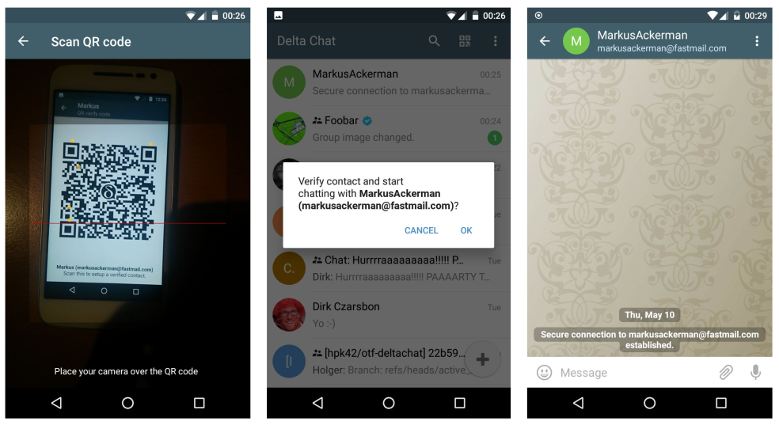

:css: talk.css

.. title: Securing Autocrypt against active attacks

----

Securing Autocrypt against active attacks
=========================================

presented at OpenPGP Summit Brussels 2018
by azul@merlinux.eu

----

CounterMitM
===========

- developed as part of NEXTLEAP research

- based on Autocrypt Level 1

- Here: Focus on OpenPGP based ideas

----

Autocrypt Level 1
=================

- prevent passive collection of email content

- usability centered

- replace clear text mail

- Autocrypt gossip to make encrypted reply to all easy.

----

Active Attacks against Autocrypt Level 1
========================================

- Machine in the middle attack (MitM)

- In band key transfer = easier for MitM

- replace Autocrypt headers with MitM keys

- continuously reencrypt

- end attack by reencrypting without replacing headers

----

Verify Contacts based on QR codes
==================================

- one person shows the QR code, other person scans.

- works with laptop & mobile

----

Underlying mechanism
====================

- similar to fingerprint printouts
  with secret to authenticate recipient

- requires confidentiallity of QR code

- system messages

- currently using Autocrypt headers for key retrieval

  could use: keyserver, wkd, etc.

----

Securing Group Communication
============================

- pairwise verification does not scale

- web of trust leaks the social graph

- gossip consistency:
  error cases instead of use cases

----

Verified groups
===============

- use cases:
  - join group
  - add member to group

- flow:
  - verify contact
  - send introduction message

----

Verified groups: Properties
===========================

- fully connected verification graph

- can replace gossip

----

Verified groups: Considerations
===============================

- Reuse verifications accross groups?

  - + easier to create new groups

  - + faster recovery from lost device

  - - combined attack of provider and verified contact

  - - less incentitive to verify contacts

----

Verified groups: Infiltrator attack
===================================

- Alice, Bob and Egon

- Egon verified Alice and Bob, started the group

- Egon collaborates with MitM attacker and introduced MitM keys

- Attacker can MitM mails between Alice and Bob

- Evidence of Egons involvement in signed messages

----

History verification
====================

- use case:
  Verifying existing contact

- flow:
  - verify contact
  - exchange message-key log

- goal: detect previous MitM attacks

----

More
====

- Claimchains:
  Privacy-preserving decentralized public key distribution based on
  cross-referencing hash chains.
  https://claimchain.github.io/

- Gossip consistency

- Using DKIM to verify Autocrypt headers

- https://github.com/nextleap-project/countermitm
