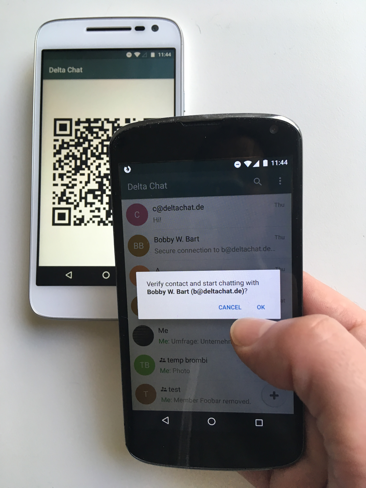

.. raw:: latex

    \newpage

Securing communications against network adversaries
===================================================

To withstand network adversaries,
peers must verify each other's keys
to establish trustable e2e-encrypted communication. In this section we describe
protocols to securely setup a contact, to securely add a user to a group, and
to verify key history.

Establishing a trustable e2e-encrypted communication channel is
particularly difficult
in group communications
where more than two peers communicate with each other.
Existing messaging systems usually require peers to verify keys with every other
peer to assert that they have a trustable e2e-encrypted channel.
This is highly unpractical.
First,
the number of verifications that a single peer must perform becomes
too costly even for small groups.
Second, a device loss will invalidate all prior verifications of a user.
Rejoining the group with a new device (and a new key)
requires redoing all the verification,
a tedious and costly task.
Finally,
because key verification is not automatic --
it requires users' involvement --
in practice very few users consistently perform key verification.

**Key consistency** schemes do not remove the need
of key verification.
It is possible
to have a group of peers
which each see consistent email-addr/key bindings from each other,
yet a peer is consistently isolated
by a network adversary performing a machine-in-the-middle attack.
It follows
that each peer needs to verify with at least one other peer
to assure that there is no isolation attack.

A known approach
to reduce the number of neccessary key verifications
is the web of trust.
This approach requires a substantial learning effort for users
to understand the underlying concepts,
and is hardly used outside specialist circles.
Moreover, when using OpenPGP,
the web of trust is usually interacting with OpenPGP key servers.
These servers make the signed keys widely available,
effectively making the social "trust" graph public.
Both key servers and the web of trust have reached very limited adoption.

Autocrypt was designed
to not rely on public key servers,
nor on the web of trust.
It thus provides a good basis
to consider new key verification approaches.
To avoid the difficulties around talking about keys with users,
we suggest new protocols
which perform key verification as part of other workflows,
namely:

- setting up a contact between two individuals who meet physically, and

- setting up a group with people who you meet or have met physically.

These new workflows require *administrative* messages
to support the authentication and security of the key exchange process.
These administrative messages are sent between devices,
but are not shown to the user as regular messages.
This is a challenge,
because some e-mail apps display all messages
(including machine-generated ones for rejected or non-delivered mails)
without special rendering of the content.
Only some messengers,
such as `Delta-chat <https://delta.chat>`_,
already use administrative messages, e.g., for group member management.

The additional advantage of using administrative messages is
that they significantly improve usability by reducing the overall number of actions
to by users.
In the spirit of the strong UX focus of the Autocrypt specification,
however,
we suggest
to only exchange administrative messages with peers
when there there is confidence they will not be displayed "raw" to users,
and at best only send them on explicit request of users.

Note that automated processing of administrative messages
opens up a new attack vector:
malfeasant peers can try to inject adminstrative messages
in order
to impersonate another user or
to learn if a particular user is online.

All protocols that we introduce in this section are *decentralized*.
They describe
how peers (or their devices) can interact with each other,
without having to rely on services from third parties.
Our verification approach thus fits into the Autocrypt key distribution model
which does not require extra services from third parties either.

Autocrypt Level 1 focusses on passive attacks
such as sniffing the mail content
by a provider.
Active attacks are outside of the scope
and can be carried out automatically
by replacing Autocrypt headers.

Here we aim to increase the costs of active attacks
by introducing a second channel
and using it to verify the Autocrypt headers
transmitted in-band.

We consider targeted active attacks
against these protections feasible.
However they will require coordinated attacks
based for example on infiltrators or real time CCTV footage.

We believe
that the ideas explained here
make automated mass surveillance prohibitively expensive
with a fairly low impact on usability.

.. _`setup-contact`:

Setup Contact protocol
-----------------------------------------

The goal of the Setup Contact protocol is
to allow two peers to conveniently establish secure contact:
exchange both their e-mail addresses and cryptographic identities in a verified manner.
This protocol is re-used
as a building block
for the `history-verification`_ and `verified-group`_ protocols.

After running the Setup Contact protocol,
both peers will learn the cryptographic identities (i.e., the keys) of each other
or else both get an error message.
The protocol is safe against active attackers that can modify, create and delete
messages.

The protocol follows a single simple UI workflow:
A peer "shows" bootstrap data
that is then "read" by the other peer through a second channel.
This means that,
as opposed to current fingerprint verification workflows,
the protocol only runs once instead of twice,
yet results in the two peers having verified keys of each other.

Between mobile phones,
showing and scanning a QR code
constitutes a second channel,
but transferring data via USB, Bluetooth, WLAN channels or phone calls
is possible as well.

Recall that
we assume that
our active attacker *cannot* observe or modify data transferred
via the second channel.

An attacker who can alter messages
but has no way of reading or manipulating the second channel
can prevent the verification protocol
from completing successfully
by droping or altering messages.

An attacker who can compromise both channels
can inject wrong key material
and convince the peer to verify it.

Here is a conceptual step-by-step example
of the proposed UI and administrative message workflow
for establishing a secure contact between two contacts,
Alice and Bob.

1. Alice sends a bootstrap code to Bob via the second channel.
   The bootstrap code consists of:

   - Alice's Openpgp4 public key fingerprint ``Alice_FP``,
     which acts as a commitment to the
     Alice's Autocrypt key, which she will send later in the protocol,

   - Alice's e-mail address (both name and routable address),

   - A type ``TYPE=vc-invite`` of the bootstrap code

   - a challenge ``INVITENUMBER`` of at least 8 bytes.
     This challenge is used by Bob's device in step 2b
     to prove to Alice's device
     that it is the device that the bootstrap code was shared with.
     Alice's device uses this information in step 3
     to automatically accept Bob's contact request.
     This is in contrast with most messaging apps
     where new contacts typically need to be manually confirmed.

   - a second challenge ``AUTH`` of at least 8 bytes
     which Bob's device uses in step 4
     to authenticate itself against Alice's device.

   - optionally add metadata such as ``INVITE-TO=groupname``

   Per ``INVITENUMBER`` Alices device will keep track of:
   - the associated ``AUTH`` secret
   - the time the contact verification was initiated.
   - the metadata provided.

2. Bob receives the bootstrap code and

   a) If Bob's device knows a key that matches ``Alice_FP``
      the protocol continues with 4b)

   b) otherwise Bob's device sends
      a cleartext "vc-request" message to Alice's e-mail address,
      adding the ``INVITENUMBER`` from step 1 to the message.
      Bob's device automatically includes Bob's AutoCrypt key in the message.

3. Alice's device receives the "vc-request" message.

   If she recognizes the ``INVITENUMBER`` from step 1
   she checks that the invite has not expired.
   If the timestamp associated with the ``INVITENUMBER``
   is not longer ago than a given time
   she processes Bob's Autocrypt key.
   Then, she uses this key
   to create an encrypted "vc-auth-required" message
   containing her own Autocrypt key, which she sends to Bob.

   If the ``INVITENUMBER`` does not match
   then Alice terminates the protocol.

4. Bob receive the "vc-auth-required" message,
   decrypts it,
   and verifies that Alice's Autocrypt key matches ``Alice_FP``.

   a) If verification fails,
      Bob gets a screen message
      "Error: Could not setup a secure connection to Alice"
      and the protocol terminates.

   b) Otherwise Bob's device sends back
      a 'vc-request-with-auth' encrypted message
      whose encrypted part contains
      Bob's own key fingerprint ``Bob_FP``
      and the second challenge ``AUTH`` from step 1.

5. Alice decrypts Bob's 'vc-request-with-auth' message,
   and verifies
   that Bob's Autocrypt key matches ``Bob_FP``
   that the invite has not expired
   and that the transferred ``AUTH`` matches the one from step 1.

   If any verification fails,
   Alice's device signals
   "Could not establish secure connection to Bob"
   and the protocol terminates.

6. If the verification succeeds on Alice's device it shows
   "Secure contact with Bob <bob-adr> established".
   In addition it sends Bob a "vc-contact-confirm" message.
   The device also removes the data associated with ``INVITECODE``.

7. Bob's device receives "vc-contact-confirm" and shows
   "Secure contact with Alice <alice-adr> established".

At the end of this protocol,
Alice has learned and validated the contact information and Autocrypt key of Bob,
the person to whom she sent the bootstrap code.
Moreover,
Bob has learned and validated the contact information and Autocrypt key of Alice,
the person who sent the bootstrap code to Bob.

   Setup Contact protocol step 2 with https://delta.chat.

Requirements for the underlying encryption scheme
~~~~~~~~~~~~~~~~~~~~~~~~~~~~~~~~~~~~~~~~~~~~~~~~~

The Setup Contact protocol requires that
the underlying encryption scheme is non-malleable.
Malleability means the encrypted content can be changed in a deterministic way.
Therefore with a malleable scheme an attacker could impersonate Bob:
They would add a different autocrypt key in Bob's vc-request message ( step 2.b )
and send the message along without other changes.
In step 4.b they could then modify the encrypted content to include
their own keys fingerprint rather than ``Bob_FP``.

..
  TODO: In case of such an attack
  the OpenPGP signature on the message body
  would be with Bob's original key.
  We could check the signature is made with the right key
  rather than adding the additional, somewhat redundant Bob_FP.

In the case of OpenPGP non-malleability is achieved
with Modification Detection Codes (MDC - see section 5.13 and 5.14 of RFC 4880).
Implementers need to make sure
to verify these
and treat invalid or missing MDCs as an error.
Using an authenticated encryption scheme prevents these issues
and is therefore recommended if possible.

An active attacker cannot break the security of the Setup Contact protocol
~~~~~~~~~~~~~~~~~~~~~~~~~~~~~~~~~~~~~~~~~~~~~~~~~~~~~~~~~~~~~~~~~~~~~~~~~~

..
  TODO: Network adversaries *can* learn who is authenticating with whom

Recall that an active attacker can
read, modify, and create messages
that are sent via a regular channel.
The attacker cannot observe or modify the bootstrap code
that Alice sends via the second channel.
We argue that such an attacker cannot
break the security of the Setup Contact protocol,
that is, the attacker cannot
impersonate Alice to Bob, or Bob to Alice.

Assume,
for a worst-case scenario,
that the adversary knows the public Autocrypt keys of Alice and Bob.
At all steps except step 1,
the adversary can drop messages.
Whenever the adversary drops a message,
the protocol fails to complete.
Therefore,
we do not consider dropping of messages further.

1. The adversary cannot impersonate Alice to Bob,
   that is,
   it cannot replace Alice's key with a key Alice-MITM known to the adversary.
   Alice sends her key to Bob in the encrypted "vc-auth-required" message
   (step 3).
   The attacker can replace this message with a new "vc-auth-required" message,
   again encrypted against Bob's real key,
   containing a fake Alice-MITM key.
   However, Bob will detect this modification step 4a,
   because the fake Alice-MITM key does not match
   the fingerprint ``Alice_FP``
   that Alice sent to Bob in the bootstrap code.
   (Recall that the bootstrap code is transmitted
   via the second channel
   the adversary cannot modify.)

2. The adversary also cannot impersonate Bob to Alice,
   that is,
   it cannot replace Bob's key with a key Bob-MITM known to the adversary.
   The cleartext "vc-request" message, sent from Bob to Alice in step 2,
   contains Bob's key.
   To impersonate Bob,
   the adversary must substitute this key with
   the fake Bob-MITM key.

   In step 3,
   Alice cannot distinguish the fake key Bob-MITM inserted by the adversary
   from Bob's real key,
   since she has not seen Bob's key in the past.
   Thus, she will follow the protocol
   and send the reply "vc-auth-required" encrypted with the key provided by the
   adversary.

   We saw in the previous part that
   if the adversary modifies Alice's key in the "vc-auth-required" message,
   then this is detected by Bob.
   Therefore,
   it forwards the "vc-auth-required" message unmodified to Bob.

   Since ``Alice_FP`` matches the key in "vc-auth-required",
   Bob will in step 4b
   send the "vc-request-with-auth" message encrypted to Alice's true key.
   This message contains
   Bob's fingerprint ``Bob_FP`` and the challenge ``AUTH``.

   Since the message is encrypted to Alice's true key,
   the adversary cannot decrypt the message
   to read its content.
   There are now three possibilities for the attacker:

   * The adversary modifies
     the "vc-request-with-auth" message
     to replace ``Bob_FP`` (which it knows) with the fingerprint of the fake
     Bob-MITM key.
     However,
     the encryption scheme is non-malleable,
     therefore,
     the adversary cannot modify the message, without being detected by Alice.

   * The adversary drops Bob's message and
     create a new fake message containing
     the finger print of the fake key Bob-MITM and
     a guess for the challenge ``AUTH``.
     The adversary cannot learn the challenge ``AUTH``:
     it cannot observe the bootstrap code
     transmitted via the second channel in step 1,
     and it cannot decrypt the message "vc-request-with-auth".
     Therefore,
     this guess will only be correct with probability :math:`2^{-64}`.
     Thus, with overwhelming probability
     Alice will detect the forgery in step 5,
     and the protocol terminates without success.

   * The adversary forwards Bob's original message to Alice.
     Since this message contains Bob's key fingerprint ``Bob_FP``,
     Alice will detect in step 5
     that Bob's "vc-request" from step 3 had the wrong key (Bob-MITM)
     and the protocol terminates with failure.

Replay attacks and conflicts
~~~~~~~~~~~~~~~~~~~~~~~~~~~~

Alices device records the time a contact verification was initiated.
It also verifies it has not expired and clears the data after
completion.
This prevents replay attacks.
Replay attacks could be used to make Alices device switch back
to an old compromised key of Bob.

Limiting an invite to a single use
reduces the impact of a QR-code
being exposed to an attacker:
If the attacker manages to authenticate faster than Bob
they can impersonate Bob to Alice.
However Bob will see an error message.
If the QR-code could be reused
the attacker could successfully authenticate.
Alice would have two verified contacts
and Bob would not see any difference to a successful
connection attempt.

Furthermore a compromise of Bob's device
would allow registering other email addresses
as verified contacts with Alice.

Business Cards
~~~~~~~~~~~~~~

QR-codes similar to the ones used for verified contact
could be used to print on business cards.

Since business cards are usually not treated as confidential
they can only serve
to authenticate the issuer of the business card (Alice)
and not the recipient (Bob).

However as `discussed on the messaging@moderncrypto mailing list`_
the verification of a short code at the end of the protocol
can extend it to also protect against leakage of the QR-code.
This may also be desirable
for users who face active surveillance in real life
and therefor cannot assume
that scanning the QR-code is confidential.

.. _`discussed on the messaging@moderncrypto mailing list`: https://moderncrypto.org/mail-archive/messaging/2018/002544.html

Open Questions
~~~~~~~~~~~~~~

- (how) can messengers such as Delta.chat
  make "verified" and "opportunistic" contact requests
  be indistinguishable from the network layer?

- (how) could other mail apps such as K-9 Mail / OpenKeychain learn
  to speak the "setup contact" protocol?

.. _`verified-group`:

Verified Group protocol
-----------------------

We introduce a new secure **verified group** that enables secure
communication among the members of the group.
Verified groups provide these simple to understand properties:

..
  TODO: Does autocrypt also protect against modification of group messages?

1. All messages in a verified group are end-to-end encrypted
   and secure against active attackers.
   In particular,
   neither a passive eavesdropper,
   nor an attactive network attacker
   (e.g., capable of man-in-the-middle attacks)
   can read or modify messages.

2. There are never any warnings about changed keys (like in Signal)
   that could be clicked away or cause worry.
   Rather, if a group member loses her device or her key,
   then she also looses the ability
   to read from or write
   to the verified group.
   To regain access,
   this user must join the group again
   by finding one group member and perform a "secure-join" as described below.

Verifying a contact to prepare joining a group
~~~~~~~~~~~~~~~~~~~~~~~~~~~~~~~~~~~~~~~~~~~~~~

The goal of the secure-join protocol is
to let Alice make Bob a member (i.e., let Bob join) a verified group
of which Alice is a member.
Alice may have created the group
or become a member prior to the addition of Bob.

In order to add Bob to the group
Alice has to verify him as a contact
if she has not done so yet.
We use this message exchange
to also ask Bob wether he agrees to becoming part of the group.

The protocol re-uses the first five steps of the `setup-contact`_ protocol
so that Alice and Bob verify each other's keys.
To ask for Bob's explicit consent we
indicate that the messages are part of the verified group protocol,
and include the group's identifier
in the metadata part of the bootstrap code.

More precisely:

- in step 1 Alice adds the metadata
  ``INVITE=<groupname>``.
  Where ``<groupname>`` is the name of the group ``GROUP``.

- in step 2 Bob manually confirms he wants to join ``GROUP``
  before his device sends the ``vc-request`` message.
  If Bob declines processing aborts.

- in step 5 Alice looks up the metadata
  associated with the ``INVITENUMBER``.
  If Alice sees the ``INVITE=<groupname>``
  but is not part of the group anymore
  she aborts the joining process
  (without sending another message).

If no failure occurred up to this point,
Alice and Bob have verified each other's keys,
and Alice knows that Bob wants to join the group ``GROUP``.

The protocol then continues as described in the following section
(steps 6 and 7 of the `setup-contact`_ are not used).

Joining a verified group ("secure-join")
~~~~~~~~~~~~~~~~~~~~~~~~~~~~~~~~~~~~~~~~

In order to add Bob to a group Alice first needs to make sure
she has a verified key for Bob.
This is the case if Bob already was a verified contact
or Alice performed the steps described in the previous section.

Now she needs to inform the group that Bob should be added.
Bob needs to confirm everything worked:

a. Alice broadcasts an encrypted "vg-member-added" message to all members of
   ``GROUP`` (including Bob),
   gossiping the Autocrypt keys of all members (including Bob).

b. Bob receives the encrypted "vg-member-added" message
   and learns all the keys and e-mail addresses of group members.
   Bob's device sends
   a final "vg-member-added-received" message to Alice's device.
   Bob's device shows
   "You successfully joined the verified group ``GROUP``".

c. Any other group member that receives the encrypted "vg-member-added" message
   will process the gossiped key through autocrypt gossip mechanisms.
   In addition they verify:

   * The encryption and Alices signature are intact.

   * They are themselves a member of ``GROUP``.

   * Alice is a member of ``GROUP``.

   If any of the checks fail processing aborts.
   Otherwise they will add Bob to their list of group members
   and mark the gossiped key as verified in the context of this group.

d. Alice's device receives the "vg-member-added-received" reply from Bob
   and shows a screen
   "Bob <email-address> securely joined group ``GROUP``"

Bob and Alice may now both invite and add more members
which in turn can add more members.
The described secure-join workflow guarantees
that all members of the group have been verified with at least one member.
The broadcasting of keys further ensures
that all members are fully connected.

Recall that this protocol does **not** consider key loss or change.
When users observe a change
in one of the Autocrypt keys belonging to the group
they must intepret this
as the owner of that key being removed from the group.
To become a member again,
a user whose key changed needs to run the secure join with
a user that is still a member.

.. figure:: ../images/join_verified_group.jpg
   :width: 200px

   Join-Group protocol at step 2 with https://delta.chat.

Notes on the verified group protocol
~~~~~~~~~~~~~~~~~~~~~~~~~~~~~~~~~~~~

- **More Asynchronous UI flow**:
  All steps after 2 (the sending of adminstrative messages)
  could happen asynchronously and in the background.
  This might be useful because e-mail providers often delay initial messages
  ("greylisting") as mitigation against spam.
  The eventual outcomes ("Could not establish verified connection"
  or "successful join") can be delivered in asynchronous notifications
  towards Alice and Bob.
  These can include a notification
  "verified join failed to complete"
  if messages do not arrive within a fixed time frame.
  In practise this means that secure joins can be concurrent.
  A member can show the "Secure Group invite" to a number of people.
  Each of these peers scans the message and launches the secure-join.
  As 'vc-request-with-auth' messages arrive to Alice,
  she will send the broadcast message
  that introduces every new peer to the rest of the group.
  After some time everybody will become a member of the group.

..
  TODO: I don't understand how the infiltrator attack works.

- **Ignoring infiltrators, focusing on message transport attacks first**:
  If one group member is "malicious" or colludes with the adversary,
  it can leak the messages' content to outsiders
  as this group member can by construction read all messages.
  Thus, we do not aim at protecting against such peers,
  and instead assume that they are honest.

  We also choose to not consider advanced attacks
  in which an "infiltrator" peer collaborates with an evil provider
  to intercept/read messages.

  We note, however,
  that such an infiltrator (say Bob when adding Carol as a new member),
  will have to sign the message containing the gossip fake keys.
  If Carol performs an oob-verification with Alice,
  she can use Bob's signature to prove
  that Bob gossiped the wrong key for Alice.

..
  TODO: could it be that the next point is stale? It references messages in
  steps that don't exist. And I don't see how (after translating this to the
  vc-request setting), the malfeasance detection differs between
  joining groups and verifying contacts.

- **Leaving attackers in the dark about verified groups**.
  It might be feasible to design
  the step 3 "secure-join-requested" message
  from Bob (the joiner) to Alice (the inviter)
  to be indistinguishable from other initial "contact request" messages
  that Bob sends to Alice to establish contact.
  This means
  that the provider would,
  when trying to substitute an Autocrypt key on a first message between two peers,
  run the risk of **immediate and conclusive detection of malfeasance**.
  The introduction of the verified group protocol would thus contribute to
  securing the e-mail encryption eco-system,
  rather than just securing the group at hand.

- **Sending all messages through alternative channels**:
  instead of being relayed through the provider,
  all messages from step 2 onwards could be transferred via Bluetooth or WLAN.
  This way,
  the full invite/join protocol would be completed
  on a different channel.
  Besides increasing the security of the joining,
  an additional advantage is
  that the provider would not gain knowledge about verifications.

- **Non-messenger e-mail apps**:
  instead of groups, traditional e-mail apps could possibly offer
  the techniques described here for "secure threads".

Autocrypt and verified key state
~~~~~~~~~~~~~~~~~~~~~~~~~~~~~~~~

Verified key material
|--| whether from verified contacts or verified groups |--|
provides stronger security guarantees
then keys discovered in Autocrypt headers.

Therefore the address-to-key mappings obtained using the verification protocols
should be stored separately
and used in preference to keys distributed in the AutoCrypt headers
in case of conflicts.
This way verified contacts and groups prevent key injection through
Autocrypt headers.

To enable users to recover from device loss,
we recommend performing new verifications.
Since performing new verifications may not always be feasible,
clients should provide the users with a way
to actively move back to an unverified state.

Open Questions about reusing verifications for new groups
~~~~~~~~~~~~~~~~~~~~~~~~~~~~~~~~~~~~~~~~~~~~~~~~~~~~~~~~~

Given a verified group that grows as described in the previous section:
What if one of the members wants to start a new group
with a subset of the members?
How safe is it in practise to allow
directly creating the group
if the creator has not verified all keys herself?

Of course, a safe answer would be
to always require a new secure-join workflow for not directly verified members.
A creator could send a message to initial group members
and ask them to add other peers they have directly verified.

Another option seems to be
to allow starting a new group with exactly the same group of people.
But what happens if the new group creator chooses to remove people from the group?
What if they were vital in setting up the verification network in the initial group?

.. _`history-verification`:

History-verification protocol
---------------------------------

The two protocols we have described so far
assure the user about the validity of
the keys they verify and of the keys of their peers in groups they join.
If the protocols detect an active attack
(for example because keys are substituted)
they immediately alert the user.
Since users are involved in a verification process,
this is the right time to alert users.
By contrast, today's verification workflows alert the users when a
previously key has changed.
At that point users typically are not physically next to each other,
and are rarely concerned with the key since they want
to get a different job done, e.g., of sending or reading a message.

However,
our new verification protocols only verify the current keys.
Historical interactions between peers may involve keys that have never been
verified using these new verification protocols.
So how can users determine the integrity of keys of historical messages?
This is where the history-verification protocol comes in.
This protocol,
that again relies on a second channel,
enables two peers
to verify integrity, authenticity and confidentiality
of their shared historic messages.
After completion, users gain assurance
that not only their current communication is safe
but that their past communications have not been compromised.

By verifying all keys in the shared history between peers,
the history-verification protocol can detect
temporary malfeasant substitutions of keys in messages.
Such substitutions are not caught by current key-fingerprint verification
workflows, because they only provide assurance about the current keys.

Like in the `setup-contact`_ protocol,
we designed our history-verification protocol so that
peers only perform only one "show" and "read" of bootstrap information
(typically transmitted via showing QR codes and scanning them).

The protocol re-uses the first five steps of the `setup-contact`_ protocol
so that Alice and Bob verify each other's keys.
We make one small modifications to indicate that
the messages are part of the history-verification protocol:
In step 1 Alice adds the metadata
``VERIFY=history``.

If no failure occurred after step 5,
Alice and Bob have again verified each other's keys.
The protocol then continues as follows
(steps 6 and 7 of the `setup-contact`_ are not used):

6. Alice and Bob have each others verified Autocrypt key.
   They use these keys to
   encrypt a message to the other party
   which contains a **message/keydata list**.
   For each message that they have exchanged in the past
   they add the following information:

   - The message id of that message
   - When this message was sent, i.e., the ``Date`` field.
   - A list of (email-address, key fingerprints) tuples
     which they sent or received in that particular message.

7. Alice and Bob independently perform
   the following history-verification algorithm:

   a) determine the start-date as the date of the earliest message (by ``Date``)
      for which both sides have records.

   b) verify the key fingerprints for each message since the start-date
      for which both sides have records of:
      if a key differs for any e-mail address,
      we consider this is strong evidence
      that there was an active attack.
      If such evidence is found,
      an error is shown to both Alice and Bob:
      "Message at <DATE> from <From> to <recipients> has mangled encryption".

8. Alice and Bob are presented with a summary which lists:

   - time frame of verification
   - the number of messages successfully verified
   - the number of messages with mangled encryption
   - the number of dropped messages, i.e. sent by one party,
     but not received by the other, or vice versa

   If there are no dropped or mangled messages, signal to the user
   "history verification successfull".

Device Loss
~~~~~~~~~~~

A typical scenario for a key change is device loss.
The owner of the lost device loses
access to his private key.
We note that when this happens,
in most cases
the owner also loses access to
his messages (because he can no longer decrypt them)
and his key history.

Thus, if Bob lost his device, it is likely
that Alice will have a much longer history for him then he has himself.
Bob can only compare keys for the timespan after the device loss.
While this verification is certainly less useful,
it would enable Alice and Bob
to detect of attacks in that time after the device lossj.

On the other hand, we can also envision
users storing their history outside of their devices.
The security requirements for such a backup are much lower
than for backing up the private key.
The backup only needs to be tamper proof,
i.e., its integrity must be guaranteed :--: not its confidentiality.
This is achievable even if the private key is lost.
Users can verify the integrity of this backup even if
they lose their private key.
For example, Bob can cryptographically sign
the key history using his current key.
As long as Bob, and others, have access to Bob's public key,
he can verify that the backup has not been tampered with.

..
  TODO: But how does bob know his public key if he lost his device?

An alternative is to permit
that Bob recovers his history from the message/keydata list
that he receives from Alice.
Then, he could validate such information
with other people in subsequent verifications.
However, this method is vulnerable to collusion attacks
in which Bob's keys are replaced in all of his peers,
including Alice.
It may also lead to other error cases
that are much harder to investigate.
We therefore discourage such an approach.

Keeping records of keys in messages
~~~~~~~~~~~~~~~~~~~~~~~~~~~~~~~~~~~

The history verification described above
requires all e-mail apps (MUAs) to record,

- each e-mail address/key-fingerprint tuple it **ever** saw
  in an Autocrypt or an Autocrypt-Gossip header in incoming mails.
  This means not just the most recent one(s),
  but the full history.

- each emailaddr/key association it ever sent out
  in an Autocrypt or an Autocrypt Gossip header.

It needs to associate these data with the corresponding message-id.

..
  TODO: This seems incomplete. To verify the history, MUAs also need
  all message-ids, even if those are deleted, or do not contain keys.
  This information is not mentioned here.j

State tracking suggested implementation
>>>>>>>>>>>>>>>>>>>>>>>>>>>>>>>>>>>>>>>

We suggest MUAs could maintain an outgoing and incoming "message-log"
which keeps track of the information in all incoming and outgoing mails,
respectively.
A message with N recipients would cause N entries
in both the sender's outgoing
and each of the recipient's incoming message logs.
Both incoming and outgoing message-logs would contain these attributes:

- ``message-id``: The message-id of the e-mail

- ``date``: the parsed Date header as inserted by the sending MUA

- ``from-addr``: the sender's routable e-mail address part of the From header.

- ``from-fingerprint``: the sender's key fingerprint of the sent Autocrypt key
  (NULL if no Autocrypt header was sent)

- ``recipient-addr``: the routable e-mail address of a recipient

- ``recipient-fingerprint``: the fingerprint of the key we sent or received
  in a gossip header (NULL if not Autocrypt-Gossip header was sent)

It is also possible
to serialize the list of recipient addresses and fingerprints into a single value,
which would result in only one entry
in the sender's outgoing and each recipient's incoming message log.
This implementation may be more efficient,
but it is also less flexible in terms of how
to share information.

Usability question of "sticky" encryption and key loss
~~~~~~~~~~~~~~~~~~~~~~~~~~~~~~~~~~~~~~~~~~~~~~~~~~~~~~

Do we want to prevent
dropping back to not encrypting or encrypting with a different key
if a peer's autocrypt key state changes?
Key change or drop back to cleartext is opportunistically accepted
by the Autocrypt Level 1 key processing logic
and eases communication in cases of device or key loss.
The "setup-contact" also conveniently allows two peers
who have no address of each other to establish contact.
Ultimately,
it depends on the guarantees a mail app wants to provide
and how it represents cryptographic properties to the user.

.. _`onion-verified-keys`:

Verifying keys through onion-queries
------------------------------------------

Up to this point this document has describe methods
to securely add contacts, form groups, and verify history
in an offline scenario where users can establish a second channel
to carry out the verification.
We now discuss how the use of Autocrypt headers can be used
to support continuous key verification in an online setting.

A straightforward approach to ensure view consistency in a group is
to have all members of the group continuously broadcasting their belief
about other group member's keys.
Unless they are fully isolated by the adversary (see Section for an analysis).
This enables every member
to cross check their beliefs about others and find inconsistencies
that reveal an attack.

However, this is problematic from a privacy perspective.
When Alice publishes her latest belief
about others' keys she is implicitly revealing
what is the last status she observed
which in turn allows
to infer when was the last time she had contact with them.
If such contact happened outside of the group
this is revealing information
that would not be available had keys not been gossiped.

We now propose an alternative
in which group members do not need to broadcast information
in order to enable key verification.
The solution builds on the observation
that the best person to verify Alice's key is Alice herself.
Thus,
if Bob wants to verify her key,
it suffices to be able to create a secure channel between Bob and Alice
so that she can confirm his belief on her key.

However,
Bob directly contacting Alice through the group channel
reveals immediately that he is interested on verifying her key
to the group members,
which again raises privacy concerns.
Instead,
we propose that Bob relies on other members
to rely the verifying message to Alice,
similarly to a typical anonymous communication network.

The protocol works as follows:

1. Bob chooses :math:`n` members of the group as relying parties
   to form the channel to Alice.
   For simplicity let us take :math:`n=2`
   and assume these members are Charlie, key :math:`k_C`,
   and David, with key :math:`k_D`
   (both :math:`k_C` and :math:`k_D` being the current belief
   of Bob regarding Charlie and David's keys).

2. Bob encrypts a message of the form
   (``Bob_ID``, ``Alice_ID`` , :math:`k_A`)
   with David and Charlie's keys in an onion encryption:

   :math:`E_{k_C}` (``David_ID``, :math:`E_{k_D}` (``Alice_ID``,(``Bob_ID``, ``Alice_ID``, :math:`k_A` ))),
   where :math:`E_{k_*}` indicates encrypted with key :math:`k_*`

   In this message ``Bob_ID`` and ``Alice_ID`` are the identifiers,
   e.g., email addresses, that Alice and Bob use to identify each other.
   The message effectively encodes the question
   'Bob asks: Alice, is your key :math:`k_A`?'

3. Bob sends the message to Charlie,
   who decrypts the message to find that it has to be relayed to David.

4. David receives Charlie's message,
   decrypts and relays the message to Alice.

5. Alice receives the message and replies to Bob
   repeating steps 1 to 4 with other random :math:`n` members
   and inverting the IDs in the message.

From a security perspective,
i.e., in terms of resistance to adversaries,
this process has the same security properties as the broadcasting.
For the adversary to be able to intercept the queries
he must MITM all the keys between Bob and others.

From a privacy perspective it improves over broadcasting
in the sense that not everyone learns each other status of belief.
Also, Charlie knows that Bob is trying a verification,
but not of whom.
However, David gets to learn
that Bob is trying to verify Alice's key,
thus his particular interest on her.

This problem can be solved in two ways:

A. All members of the group check each other continuously so as
   to provide plausible deniability regarding real checks.

B. Bob protects the message using secret sharing
   so that only Alice can see the content once all shares are received.
   Instead of sending (``Bob_ID``, ``Alice_ID`` , :math:`k_A`) directly,
   Bob splits it into :math:`t` shares.
   Each of this shares is sent to Alice through a *distinct* channel.
   This means that Bob needs toe create :math:`t` channels, as in step 1.

   When Alice receives the :math:`t` shares
   she can recover the message and respond to Bob in the same way.
   In this version of the protocol,
   David (or any of the last hops before Alice) only learns
   that someone is verifying Alice,
   but not whom, i.e., Bob's privacy is protected.

Open Questions about onion online verification
~~~~~~~~~~~~~~~~~~~~~~~~~~~~~~~~~~~~~~~~~~~~~~
An open question is
how to choose contacts to rely onion verification messages.
This choice should not reveal new information about users' relationships
nor the current groups where they belong.
Thus, the most convenient is
to always choose members of the same group.
Other selection strategies need to be analyzed
with respect to their privacy properties.

The other point to be discussed is bandwidth.
Having everyone publishing their status implies N*(N-1) messages.
The proposed solution employs 2*N*n*t messages.
For small groups the traffic can be higher.
Thus, there is a tradeoff privacy vs. overhead.

.. |--| unicode:: U+2013   .. en dash
.. |---| unicode:: U+2014  .. em dash, trimming surrounding whitespace
   :trim:
