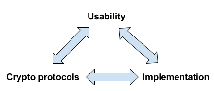

Securing Autocrypt against active attacks
=============================================

- What is Autocrypt Level 1? Why E-Mail?

- DKIM and Autocrypt Key gossip as verifications

- ClaimChains and keeping histories

- Prioritized Out-of-Band verification

**R&D in progress, NEXTLEAP project**

----

**"Security as a product of shared human outcomes"**

(E. Saitta)

----

Autocrypt Level 1 spec
========================================

**Autocrypt Level 1 for users**:

- one-click encryption

- easing encrypted group replies

- support for setting up multiple device

**never ask users about keys, ever!**

----

Why "E-Mail"?
=====================

- largest socially federated messaging network

- all kinds of organizations need it

- also: new mail apps can change social use

----

Delta.chat (Android)
==========================

- codewise: Telegram UI + E-mail/Autocrypt backend

- shows: convenient messaging over e-mail possible!

- freeing users from "in-app-only" messenging
  (``ETOOMANYMESSENGERS``)

----

Autocrypt Key Gossip
======================

- members' keys are in sign+encrypted group-messages

- allows recipients to reply encrypted to all

- complicates targetted attacks from message transport layer
  (peers can track inconsistencies)

----

DKIM signing of Autocrypt headers
=================================

- providers starting to sign Autocrypt headers
  (Posteo.de, others upcoming)

- if only one out of two providers in an e-mail transactions
  performs MITM attack, peers can notice DKIM verification
  failures

----

ClaimChains
==================

- framework for decentralized key consistency

- peers maintain key-related claims, verifications
  in "chains"

- peers can exchange chain entries or head hashes
  in "online" and "offline" variants

----

ClaimChain "Key consistency"
=================================

- CONIKS: highly online-system to maintain
  key consistency/transparency
  (nobody deployed it yet)

- ClaimChain (CC): can work offline/decentralized,
  thus avoiding turning providers into CAs -- they
  rather become accountable for not manipulating
  headers.

----

Decentralized "offline" ClaimChain
==================================

- "in-band" CC does not depend on online services

- CC can integrate "gossip" keys and facts about
  DKIM verification (and used keys)

- if needed, special claimchain-related headers
  can be added to regular encrypted messages

----

ClaimChain and Out-Of-Band verification
---------------------------------------

Design approach:

- users trigger their MUAs to compare
  key **histories** (own and common contacts)

- peers communicate claim chain contents
  through an "out-of-band" verified channel

Usability goal:

**provide users with conclusive evidence for
MITM attacks, distinguished from common
'new device setup' events**

----

Comparing key histories
-----------------------

- MUAs exchange "peer chains" which contains
  message flows between the two respective peers

- can determine if a message was modified during
  time ranges contained in both peer's histories
  ("shared history")

- a modified Autocrypt header in a message contained
  in shared history provides conclusive evidence
  for MITM attack (disambiguates from "lost device")

----

out-of-band verification
=========================

two techno-social flows to consider:

(1) have two MUAs initiate a secured connection
    in e.g. the local WLAN and exchange further
    messages there.

(2) have to MUAs verify fingerprints+emailaddress
    and then send a regular looking message with extra
    information in the encrypted content.

notes:

- (2) can serve as fallback to (1)

- in either case we have an "out-of-band" channel
  where additional messages can be exchanged.

----

Usability ideas related to OOB/chains
-------------------------------------

- offer a prioritized list (per-group and/or global)
  of which peers to oob-verify with.

- key inconsistencies (from gossip or device change)
  raise priority of getting new oob-verification

- oob-verification gossip can also be sent along
  regular messages (in headers or attachments
  of encrypted message parts)

----

new UX: Verified Groups
==========================================

- OOB-verify and join a group in one step

- gossip new oob-verified member+key to group

- lost key requires new OOB verification

**new security practise for activists?**

----

Ongoing Efforts 2018
----------------------------

- R&D with Carmela Troncoso/EPFL and
  NEXTLEAP partners on chain designs

- https://muacrypt.readthedocs.io for
  chain and oob implementations, to be used in
  "expert" mail setups and from mailman/ML software

- https://delta.chat to implement QR-based OOB
  verification + join?

- user-testing with activists

----

Open issues
-------------------------------------

- precise definition of PeerChain, KeyChain
  and OOB-verification Chains

- algorithm/design to have two peers verify
  "shared contacts" in a "contact privacy-preserving"
  way (i.e. my peer should not know when or maybe even
  if i oob-verified a shared contact).

- design UI flows for OOB "prioritization"
  and for performing verifications.

- ongoing OTF proposal to perform Delta.Chat
  user-testing with activists in repressive contexts

- feedback into development of next-level
  Autocrypt specifications
